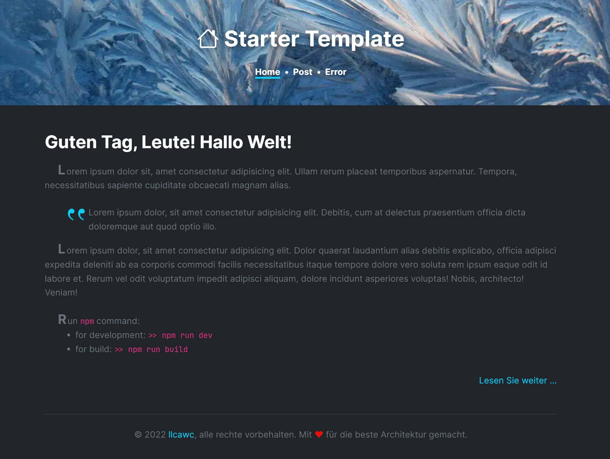

# Starter template for quicks builds

_Revision 0.0.2 from 2022.05.04_

> Starter template for quicks builds, witch use Gulp, Dart SASS, PostCSS, Rollup and Imagemin.

---

&copy;&nbsp;2022 [llcawc](https://github.com/llcawc), all rights reserved. Made&nbsp;with&nbsp;&#10084;&nbsp;for&nbsp;the&nbsp;best&nbsp;architecture.
